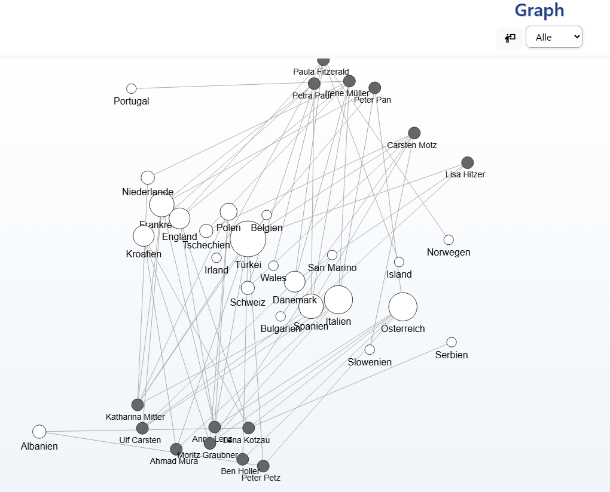
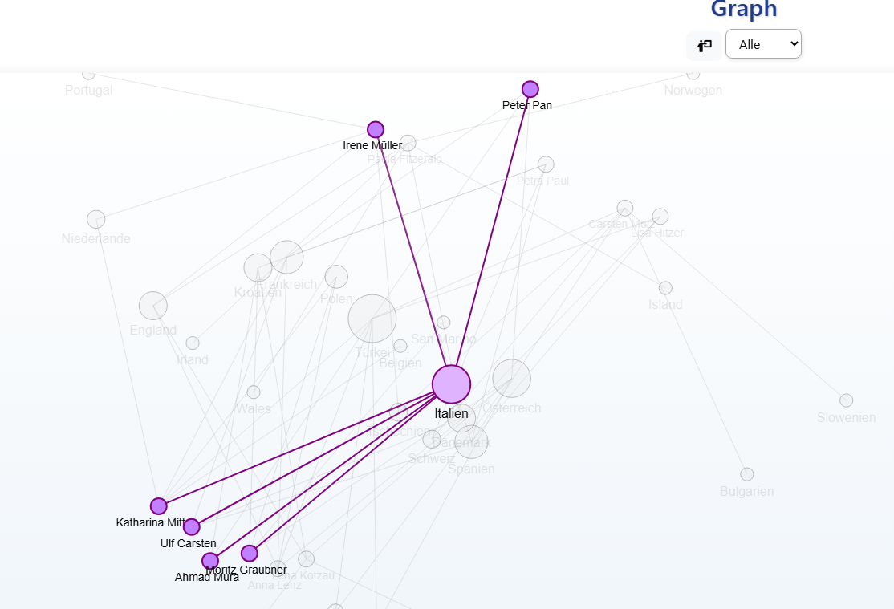
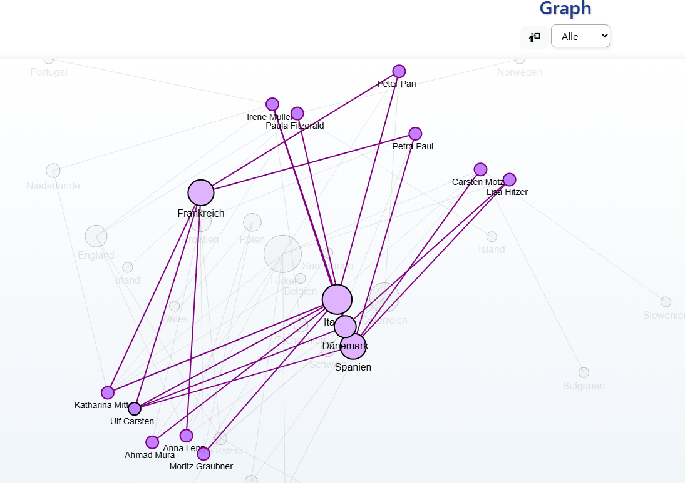

# Graph

Graph is a preset for the Moodle activity database.

## Description

Representations of relationships in a graph.


In this example, students have entered the countries they have visited.  
- Entries must be separated by commas.  
- There is only one database field in this example, so only one category exists.  
- The larger the bubble, the more frequently the country is mentioned.  

<b>IMportant: It is possible to create many database fields and use them as categories.</b>


Click on a country to see which students have visited it.


Click on a student to see all other students with the same name.  
You can then view:  
- The countries the student has visited  
- Who else has visited these countries

## Getting started

Download the [release file](https://github.com/fdagner/graph__moodle-database-preset/releases). 
Create a "Database" activity in Moodle and then upload the ZIP file.

### Steps

1. Create database fields for the categories (short text or dropdown).
2. Reset the current template for adding entries.
3. Customize the list template:

```
{
name: '##user## ##edit## ##delete##',
Länder: '[[state]]',
},
```
<b>Important: The main category must be named 'name'.</b>

```
{
name: '[[nickname]] ##edit## ##delete##',
Länder: '[[state]]',
},
```
You can also do it this way.

## Language Support

The preset is available in German, but there is not so much to translate. The template can easily be adapted.

